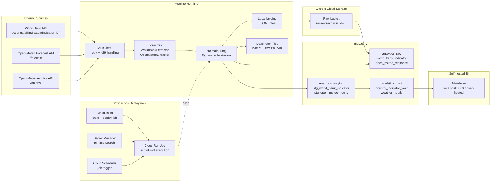

# GCP Big Data Visualisation Starter

Production-ready starter skeleton for an **API -> GCS -> BigQuery -> SQL transforms -> self-hosted Metabase** pipeline.

## Quick Start

1. Create local env file:
   ```bash
   cp .env.example .env
   ```
2. Set required environment variables (`GCP_PROJECT_ID`, `GCS_BUCKET`).
3. Authenticate once on the host for Google Application Default Credentials:
   ```bash
   gcloud auth application-default login
   ```
4. Validate the code and run the pipeline with Docker:
   ```bash
   make docker-test
   make docker-run
   ```

## Native Python Workflow

Use this only if you want to run the project outside Docker. It requires Python 3.11 and `poetry` on your `PATH`.

1. Install dependencies:
   ```bash
   poetry install
   ```
2. Validate the code:
   ```bash
   make lint
   make test
   ```
3. Run the pipeline:
   ```bash
   make run
   ```

## Environment Variables

See `.env.example`. Highlights:
- `WORLD_BANK_INDICATOR_IDS`, `WORLD_BANK_PAGE_SIZE`
- `OPEN_METEO_LOCATIONS`, `OPEN_METEO_HOURLY_VARIABLES`, `OPEN_METEO_TIMEZONE`
- `GCS_BUCKET`, `GCS_RAW_PREFIX`
- `BQ_RAW_DATASET`, `BQ_STAGING_DATASET`, `BQ_MART_DATASET`
- `LOCAL_DATA_DIR`, `DEAD_LETTER_DIR`
- `API_TOKEN` is optional for the currently configured public APIs

## Pipeline Flow

1. Fetch paginated World Bank indicator records and Open-Meteo forecast/archive payloads.
2. Land raw JSONL locally with source-specific metadata.
3. Upload JSONL to `gs://<bucket>/raw/...`.
4. Load raw payloads into `analytics_raw`.
5. Run typed MERGE transforms into `analytics_staging`.
6. Build Metabase-friendly MERGE marts in `analytics_mart`.

## Architecture Diagram



The diagram reflects the implemented runtime path: Python extracts from both public APIs, writes raw JSONL locally, uploads to GCS, loads BigQuery raw tables, runs SQL transforms into staging and mart tables, and exposes the marts to Metabase. Dead-letter files capture malformed payloads before raw load. In production, Cloud Build deploys the Cloud Run Job, Secret Manager provides runtime secrets, and Cloud Scheduler triggers execution.

## Operational Design Notes

- **Idempotency**: merge-based staging and mart SQL keyed on business keys.
- **Schema drift**: BigQuery load job allows field additions and unknown fields.
- **Retries/backoff**: API client wrapped with `tenacity` exponential jitter.
- **Dead-letter strategy**: malformed source payloads are written to `DEAD_LETTER_DIR` before raw load.
- **Rate limits**: API client retries transient network failures plus HTTP `429` and `5xx` responses.

## Run with Docker

```bash
make docker-run
```

Docker is now enough for local execution. You do not need Poetry or a local Python 3.11 install if you use the container targets.

Useful containerized commands:

```bash
make docker-build
make docker-lint
make docker-test
make docker-run
```

Notes:
- `docker-build` builds the `runtime` target explicitly.
- `docker-lint` and `docker-test` use the Docker `dev` target with dev dependencies installed.
- `docker-run` reads `.env` and runs the pipeline in the runtime container.
- `docker-run` mounts Google Application Default Credentials from `~/.config/gcloud/application_default_credentials.json` by default.

Before the first local container run, authenticate once on the host:

```bash
gcloud auth application-default login
```

## Test Coverage

- `make test` runs the local pytest suite.
- `make docker-test` runs the same tests inside the Docker `dev` image.
- The suite includes configuration validation tests, API client tests, extractor tests, retry tests, and an orchestration-level integration test for `src.main.run()`.

## Deploy Notes (Cloud Run Job)

`infra/cloudbuild.yaml` now builds an Artifact Registry image and deploys a Cloud Run Job with runtime env vars and optional Secret Manager bindings.

Production prerequisites:
- Create the Artifact Registry repository referenced by `_AR_REPOSITORY`.
- Create the Cloud Run runtime service account referenced by `_SERVICE_ACCOUNT`.
- Grant the runtime service account least-privilege access to GCS, BigQuery, and Secret Manager.
- Create any runtime secrets and pass them through `_SECRET_VARS`.

Example secret mapping:

```text
_SECRET_VARS=API_TOKEN=api-token:latest
```

Example deploy:

```bash
gcloud builds submit \
  --config=infra/cloudbuild.yaml \
  --substitutions=_GCS_BUCKET=your-raw-bucket,_SECRET_VARS=API_TOKEN=api-token:latest \
  .
```

Shortcut:

```bash
make deploy
```

Recommended follow-up:
- Trigger the job from Cloud Scheduler hourly/daily.
- Keep non-secret runtime config in Cloud Run Job env vars.
- Keep credentials and tokens in Secret Manager only.
- Point Cloud Run local scratch paths at `/tmp/...`, which is already reflected in `infra/cloudbuild.yaml`.

## Reporting Layer

This project now targets self-hosted Metabase.

- Connect Metabase to `analytics_mart.country_indicator_year` and `analytics_mart.weather_hourly` in BigQuery.
- Keep reusable business logic in BigQuery SQL, not in Metabase question-level expressions.
- Start Metabase locally with:

```bash
export METABASE_ENCRYPTION_SECRET_KEY='replace-with-a-long-random-secret'
make metabase-up
```

- Metabase is exposed at `http://localhost:8080`.

- Stop it with:

```bash
make metabase-down
```

- See [docs/metabase.md](/Users/ryankenny/Projects/GCPBigDataVisualisation/docs/metabase.md) for connection and dashboard guidance.

## dbt Optional Path

This starter runs SQL without dbt first. If adopting dbt later:
- Move `src/transform/sql` scripts into dbt models.
- Keep raw ingestion/orchestration in Python.
- Add dbt run/test step after raw load.

## Open Production Follow-ups

- Tune retry counts, timeout values, and archive/forecast window sizes using production traffic data.
- Review BigQuery partition retention and clustering choices against real query patterns and cost targets.
