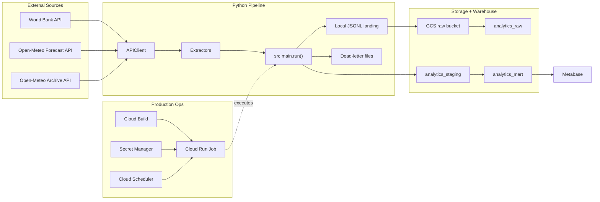

# Architecture

## Layers

- **Extract**: Paginated API pulls using incremental watermark.
- **Land**: JSONL files persisted locally then uploaded to GCS raw prefix.
- **Load**: BigQuery raw table keeps full payload (`JSON`) + metadata columns.
- **Transform**: SQL scripts produce typed staging and BI mart tables.
- **Consume**: self-hosted Metabase connects to mart tables in BigQuery for dashboards.

## Diagram

## Dataset convention

- `raw`: immutable-ish ingestion history.
- `staging`: typed, deduped, latest-state entities.
- `mart`: BI-friendly aggregates.

## Naming convention

- Raw tables: `api_<entity>_raw`
- Staging tables: `stg_<entity>`
- Mart tables: `<business_subject>_<grain>`
